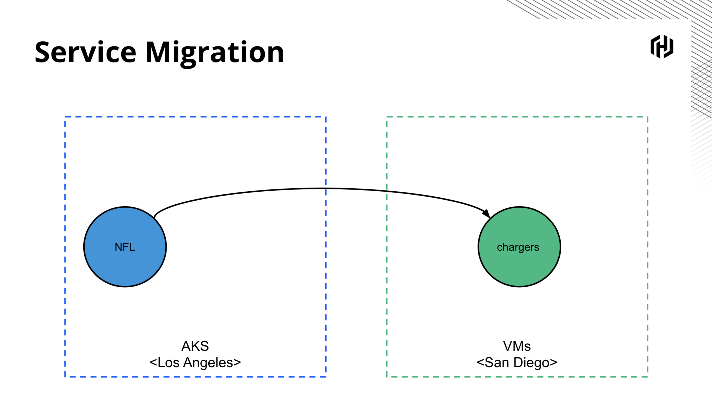
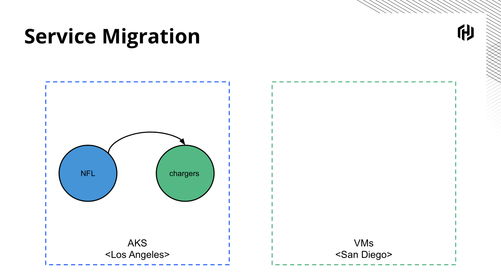

# Consul ServiceMeshCon 2019 Demo

This repository contains the code used during my lightning talk
[Connecting and Migrating Heterogeneous Applications with Consul Service Mesh](https://events19.linuxfoundation.org/events/servicemeshcon-2019/program/schedule/)
given at ServiceMeshCon 2019.

Video of talk: <not yet published>
Slides: https://speakerdeck.com/lkysow/connecting-and-migrating-applications-with-consul-service-mesh

## Overview
During this talk I migrated the `chargers` service running on a VM into Kubernetes without downtime.
The service was being called from Kubernetes by the `nfl` service.

From:


To:



## Setup
The setup involved two parts: the VM (running on Google Cloud Platform) and Kubernetes (running in Azure Kubernetes Service).
**NOTE: This setup does not cover enabling ACLs or TLS for Consul. This is only for a quick demo. If you leave this
open then an attacker will find a way to exploit Consul.** 

We create one node Consul clusters on AKS and the VM, federate them using the AKS
cluster as the primary DC, start mesh gateways so the clusters can route to one
another, then start the `chargers` service on the VM.

### Azure Kubernetes Service (AKS)
How to setup Consul and dependencies on AKS.

#### Install Consul
* Create an AKS cluster
* Run `kubectl apply -f azure-external-lb.yaml`. This LB will expose our Consul
  server externally. We apply it first so we can get the external IP address and
  use that in our Consul config.
* Run `git clone https://github.com/hashicorp/consul-helm.git`
* Replace the external IP in `azure-values.yaml` under the `server.extraConfig.advertise_addr_wan` key:
  ```hcl
  server:
    ...
    extraConfig: |
      {
        "primary_datacenter": "azure",
        "advertise_addr_wan": "<replace me>"
      }
  ```
* Generate a gossip encryption with `consul keygen` and use it in `azure-encryption-key-secret.yaml`.
* Apply the encryption key secret with `kubectl apply -f azure-encryption-key-secret.yaml`
* Run `helm install hashicorp ./consul-helm -f azure-values.yaml` (I used Helm 3).
* Get the external IP of the `hashicorp-consul-mesh-gateway` service and replace in
  `azure-values.yaml` the `meshGateway.wanAddress.host` value:
```yaml
meshGateway:
  wanAddress:
    host: <replace me>
```
* Redeploy the mesh gateway with `helm upgrade hashicorp ./consul-helm -f azure-values.yaml`

#### Install the NFL service
```bash
kubectl apply -f azure-nfl-service.yaml
```

### VM
How to set up Consul and the chargers service on the VM.

#### Install Dependencies
* Spin up an Ubuntu VM on GCP with an external IP
* Install Consul from https://www.consul.io/downloads.html and place in `/usr/local/bin/consul`
* Install Envoy via https://www.getenvoy.io/install/envoy/ubuntu/ and place in `/usr/bin/envoy`
* Install `fake-service` from https://github.com/nicholasjackson/fake-service/releases/ and place
  it in `/usr/local/bin/fake-service-linux`. This will be the chargers service.
* Open up the firewall on `tcp:9090,8500,8302,8300,19000,8443,19001`. I opened it to
  my laptop's IP and the external IP of the AKS cluster (I ran `curl ifconfig.me/ip` from
  the Consul server Pod to find it).

#### Configure Consul
* Create `systemd` unit file for Consul at `/etc/systemd/system/consul.service`:
    ```systemd
    [Unit]
    Description="HashiCorp Consul - A service mesh solution"
    Documentation=https://www.consul.io/
    Requires=network-online.target
    After=network-online.target
    ConditionFileNotEmpty=/etc/consul.d/consul.hcl
    
    [Service]
    Type=exec
    User=consul
    Group=consul
    ExecStart=/usr/local/bin/consul agent -config-dir=/etc/consul.d/
    ExecReload=/usr/local/bin/consul reload
    KillMode=process
    Restart=on-failure
    LimitNOFILE=65536
    
    [Install]
    WantedBy=multi-user.target
    ```
* Get the external IP that you'll use for the `advertise_addr_wan` setting from the GCP console.
* Get the encryption key used for the AKS cluster. You'll use this in your `encrypt` setting.
* Get the IP address used for the AKS cluster in its `advertise_addr_wan` setting. You'll use this
  in your `retry_join_wan` setting.
* Create config file at `/etc/consul.d/consul.hcl` using the external IP and the encryption key used to
  set up the Azure cluster:
    ```hcl
    # Use your own values here
    encrypt = "<replace me>"
    advertise_addr_wan = "<replace me>"
    retry_join_wan = ["<replace me>"]
  
    # The rest can stay the same
    datacenter = "vms"
    data_dir = "/opt/consul"
    bootstrap_expect = 1
    server = true
    ui = true
    advertise_addr = "{{ GetPrivateIP }}"
    client_addr = "0.0.0.0"
    primary_datacenter = "azure"
    connect {
      enabled = true
    }
    ports {
      grpc = 8502
    }
    enable_central_service_config = true
    config_entries {
      bootstrap = [
        {
          Kind = "proxy-defaults"
          Name = "global"
          MeshGateway {
            Mode = "local"
          }
          Config {
            Protocol = "http"
          }
        }
      ]
    }
    ```
* Start consul with `sudo systemctl daemon-reload && sudo systemctl start consul`
* You should be able to go to the external IP of the VM on port 8500 and see the
  Consul UI.
* You should be able to click on "vms" in the top right and select the "azure" datacenter.
* You should be able to run `consul members -wan` and see
  ```bash
  Node                             Address              Status  Type    Build  Protocol  DC     Segment
  hashicorp-consul-server-0.azure  <aks ip>:8302  alive   server  1.6.2  2         azure  <all>
  ubuntu.vms                       <vm ip>:8302    alive   server  1.6.2  2         vms    <all>
  ```
* If you run `consul monitor` you'll see errors like
  ```bash
  2019/11/22 20:26:48 [WARN] memberlist: Was able to connect to hashicorp-consul-server-0.azure but other probes failed, network may be misconfigured
  ```
  This is because we're only using tcp when connecting to the AKS consul server. This is okay.
  
#### Configure Chargers service
* Create `/etc/systemd/system/chargers.service`:
  ```
  [Unit]
  Description="Chargers"
  Documentation=https://www.consul.io/
  Requires=network-online.target
  After=network-online.target

  [Service]
  Type=exec
  User=consul
  Group=consul
  Environment=LISTEN_ADDR=0.0.0.0:8000
  Environment=MESSAGE="Go San Diego Chargers!"
  ExecStart=/usr/local/bin/fake-service-linux
  KillMode=process
  Restart=on-failure
  LimitNOFILE=65536

  [Install]
  WantedBy=multi-user.target
  ```
* Run `sudo systemctl daemon-reload && sudo systemctl start chargers`
* You should be able to run `curl localhost:8000`:
  ```json
  {
    "name": "Service",
    "uri": "/",
    "type": "HTTP",
    "ip_addresses": [
      "10.128.0.23",
      "172.17.0.1"
    ],
    "start_time": "2019-11-22T20:31:28.287186",
    "end_time": "2019-11-22T20:31:28.289075",
    "duration": "1.889687ms",
    "body": "Go San Diego Chargers!",
    "code": 200
  }
  ```
* Add the service definition to Consul by creating `/etc/consul.d/service.hcl`:
```json
{
  "service": {
    "name": "chargers",
    "port": 8000,
    "connect": {"sidecar_service": {}}
  }
}
```
* Run `consul reload`
* You should see the `chargers` service in the Consul UI

#### Configure Chargers Sidecar Proxy
* Create `/etc/systemd/system/chargers-sidecar.service`:
    ```
    [Unit]
    Description="Chargers Sidecar Proxy"
    Documentation=https://www.consul.io/
    Requires=network-online.target
    After=network-online.target
    ConditionFileNotEmpty=/etc/consul.d/consul.hcl

    [Service]
    Type=exec
    User=consul
    Group=consul
    ExecStart=/usr/local/bin/consul connect envoy -sidecar-for=chargers \
      -admin-bind=0.0.0.0:19001
    KillMode=process
    Restart=on-failure
    LimitNOFILE=65536

    [Install]
    WantedBy=multi-user.target
    ```  
* Run `sudo systemctl daemon-reload && sudo systemctl start chargers-sidecar`
* You should see the `chargers-sidecar` service in the Consul UI

#### Configure Mesh Gateway
* Create `/etc/systemd/system/mesh-gateway.service`:
  ```
  [Unit]
  Description="Consul Mesh Gateway"
  Documentation=https://www.consul.io/
  Requires=network-online.target
  After=network-online.target

  [Service]
  Type=exec
  User=consul
  Group=consul
  ExecStart=/usr/local/bin/consul \
    connect \
    envoy \
    -mesh-gateway \
    -wan-address=<external ip>:8443 \
    -address=127.0.0.1:8443 \
    -admin-bind="0.0.0.0:19000" \
    -bind-address=default=0.0.0.0:8443 \
    -register
  KillMode=process
  Restart=on-failure
  LimitNOFILE=65536

  [Install]
  WantedBy=multi-user.target
  ```
* Replace `-wan-address` with the external IP of the VM.
* Run `sudo systemctl daemon-reload && sudo systemctl start mesh-gateway`
* You should see the `mesh-gateway` service in the Consul UI.

## Demo
Now you're ready to do the demo!

### Setup the Curl
First we want to start `curl`'ing the `chargers` service from the `nfl` service
* Get the pod IP of your `nfl` Pod and run `export NFL=<your pod ip>`
* Run
    ```bash
    kubectl exec $NFL -- sh -c "while true; do curl -sS localhost:1234 | grep body; sleep 0.5; done"
    Defaulting container name to nfl.
    Use 'kubectl describe pod/nfl-7445678695-qkb4b -n default' to see all of the containers in this pod.
      "body": "Go San Diego Chargers!",
      "body": "Go San Diego Chargers!",
      ...
    ```
* If you're not seeing this response then your nfl service can't talk to the chargers service in your VM.

### Prep for migration
Next, we'll create routing rules so that when we deploy the chargers service into
AKS, it won't get routed to immediately.

```bash
kubectl port-forward svc/hashicorp-consul-server 8500 & # so we can run consul commands localy
consul config write proxy-defaults.hcl # so we use the mesh gateways
consul config write service-defaults.hcl # set the protocol to http
consul config write service-resolver-azure.hcl # so we can target the chargers service in azure with the name 'chargers-azure'
consul config write service-resolver-vms.hcl # so we can target the chargers service on vms with the name 'chargers-vms'
consul config write service-splitter.hcl # so we always route to the vms chargers service
```

### Migrate
Now we'll deploy the chargers service onto AKS
```bash
kubectl apply -f azure-chargers-service.yaml
```

You should see no change to the `curl` that was running. You should still be seeing the San Diego message.

### Test the connection
Now we'll test that we can route from the nfl service to the chargers service running on Azure.
We'll create an routing rule that targets the `chargers-azure` service when a header is set.
```bash
consul config write service-router.hcl
```

Now test the connection:
```bash
$ kubectl exec $NFL -- curl -H "X-Datacenter: azure" -s localhost:1234
Defaulting container name to nfl.
Use 'kubectl describe pod/nfl-7445678695-qkb4b -n default' to see all of the containers in this pod.
{
  "name": "Service",
  "uri": "/",
  "type": "HTTP",
  "ip_addresses": [
    "10.244.5.15"
  ],
  "start_time": "2019-11-22T20:47:21.499813",
  "end_time": "2019-11-22T20:47:21.499874",
  "duration": "60.8µs",
  "body": "Go LA Chargers!",
  "code": 200
}
```

You should see the response from the LA Chargers service. If you look at the
`curl` running in the `while` loop, it should not have changed.

### Migrate traffic
Now we're ready to migrate real traffic over. We'll edit the `service-splitter.hcl` to
split 50/50:
```diff
kind = "service-splitter"
name = "chargers"
splits = [
  {
-    weight         = 100
+    weight         = 50
    service = "chargers-vms"
  },
  {
-    weight         = 0
+    weight         = 50
    service = "chargers-azure"
  },
]
``` 

```bash
consul config write service-splitter.hcl
```

The `while` loop should see both the LA and San Diego messages.
Now we'll flip 100% to AKS:

```diff
kind = "service-splitter"
name = "chargers"
splits = [
  {
-    weight         = 50
+    weight         = 0
    service = "chargers-vms"
  },
  {
-    weight         = 50
+    weight         = 100
    service = "chargers-azure"
  },
]
``` 

```bash
consul config write service-splitter.hcl
```

### Conclusion
Our migration is complete! Remember to shut down these resources since the Consul server is exposed.
